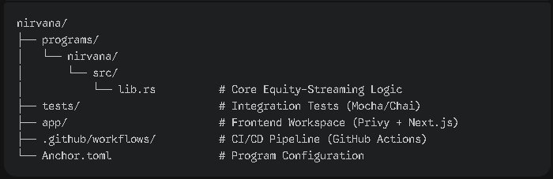
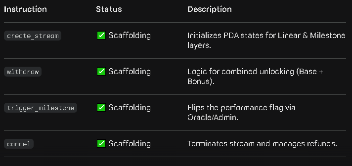

# 🎋 Nirvana Protocol: Equity-Streaming Engine

Nirvana is a specialized Solana program designed for **Equity-Streaming**, a hybrid distribution model that synchronizes continuous linear token unlocks with event-driven performance milestones. 

This project solves the "Gamble vs. Cashflow" dilemma for Web3 contributors by providing guaranteed liquidity (Base Layer) alongside performance-based rewards (Milestone Layer).

## 🚀 Quick Start (Under 15 Minutes)

### 1. Prerequisites
Before setting up, ensure you have the following installed:
* **Rust**: `rustc 1.75.0` or later
* **Solana CLI**: `solana-cli 3.1.0` or later (Agave)
* **Anchor CLI**: `anchor-cli 1.0.0`
* **Node.js**: `v18.18.0` or later
* **NPM**

### 2. Local Setup
Clone the repository and install dependencies:

```bash
git clone https://github.com/rikokurnia/nirvana-infinity.git
cd nirvana-infinity
npm install
```

---

### 3. Build & Compile
To compile the smart contract and generate the IDL:

```bash
CARGO_TARGET_DIR=$PWD/target anchor build --ignore-keys
```

Note: `--ignore-keys` is required when the local deploy keypair does not match the program ID declared in source (`FxPnV48...`). This generates `target/deploy/nirvana.so` and `target/idl/nirvana_protocol.json`.

### 4. Running Tests

**Option A: Test script (recommended)**

```bash
chmod +x run-tests.sh
./run-tests.sh
```

The script starts a local validator, loads the program at the declared devnet ID via `--bpf-program`, and runs the full Mocha suite (~2 minutes).

**Option B: Manual**

```bash
# Terminal 1
solana-test-validator --reset \
  --bpf-program FxPnV48rg9KkK6huUimjcjL9H4xssM8n7j3uva8k9tmc \
  target/deploy/nirvana.so

# Terminal 2
ANCHOR_WALLET=~/.config/solana/id.json \
ANCHOR_PROVIDER_URL=http://localhost:8899 \
NODE_OPTIONS="--no-experimental-strip-types" \
npm test
```

Note: The test suite covers stream creation, cliff/milestone vesting, cancel splits, arbiter triggers, and `top_up`.

---

### 🛠 Project Structure


---

## 🌍 Live Demo

**Frontend:** https://nirvana-infinity.vercel.app

**Program ID (Devnet):** `FxPnV48rg9KkK6huUimjcjL9H4xssM8n7j3uva8k9tmc`

---

## 📑 Program Features
The program implements the following Equity-Streaming architecture:

| Instruction | Description |
|-------------|-------------|
| `create_stream` | Initializes vesting state, transfers tokens to PDA vault |
| `withdraw` | Claims matured tokens (linear + milestone) |
| `cancel` | Terminates stream, pays recipient unlocked portion, refunds creator |
| `trigger_milestone` | Flips `milestone_achieved` flag (oracle/admin only) |
| `top_up` | Adds tokens and/or extends end time on a live stream |
| `release_vault` | Cleans up orphaned vaults from pre-cancel-upgrade streams |



---

## 🌐 Deployment to Devnet

### 1. Configure Solana CLI to Devnet:
```bash
solana config set --url devnet --keypair ~/.config/solana/id.json
```

### 2. Airdrop SOL for gas (if needed):
```bash
solana airdrop 2
```

### 3. Deploy:
```bash
anchor program deploy --provider.cluster devnet
```

Or manually:
```bash
solana program deploy target/deploy/nirvana.so --program-id target/deploy/nirvana-keypair.json
```

---

## 🤖 CI/CD Integration
This repository is equipped with **GitHub Actions**. Every push or pull request triggers a workflow that:
1. Sets up Solana 3.1 + Anchor 1.0.
2. Runs `anchor build --ignore-keys` and verifies build artifacts.
3. Executes `./run-tests.sh` (29 integration tests).

---

## 🖥️ Frontend (Week 6)

The `frontend/` directory contains the Next.js 15 App Router UI.

### Features
- **Wallet connection** — Privy embedded wallet + Phantom/Solflare via Solana Wallet Standard
- **Founder dashboard** — create streams (multi-recipient, token select, preset splits, optional cliff), view/cancel active streams, transaction history
- **Worker dashboard** — list incoming streams, dual-layer progress bars (linear + milestone), one-click withdraw
- **mUSDC faucet** — in-app button mints devnet mock USDC to the connected wallet (server-side, keypair never exposed)
- **Loading states** — every transaction shows wallet approval → sending → confirming feedback
- **Error messages** — on-chain errors decoded and shown inline
- **Nonce-seeded PDAs** — same founder → recipient pair can have unlimited concurrent/sequential streams (no collision)

### Frontend Setup

```bash
cd frontend
cp .env.example .env.local   # fill in NEXT_PUBLIC_PRIVY_APP_ID, NEXT_PUBLIC_MOCK_USDC_MINT, MOCK_USDC_FAUCET_SECRET
npm install
npm run dev
```

Open http://localhost:3000.

---

## 👥 Contributor Roles

* **Sora Onchain (@SoraOnchain)**: Lead Architect. Smart contract design, account struct definitions, all on-chain instructions, CI pipeline.
* **Riko Kurnia (@rikokurnia)**: Frontend Integration. Full Next.js UI (dashboard, create/cancel/withdraw flows, faucet, history), Anchor integration layer (`lib/anchor.ts`), nonce-seeded PDA fix, devnet deployment.

---

## 📜 License
MIT License. Created for Mancer Season 1.
